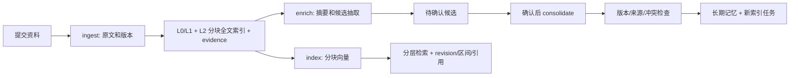

# Si-agent 第四周验收报告：记忆生命周期

第四周将资料索引升级为分块索引，并建立候选、精确证据、历史版本、冲突和忘记屏障。
项目聊天与 Langfuse 仍按第五周推进，旧 CLI 记忆链路保持兼容。

## 本轮完成的能力

| 方面 | 实现 | 解决的问题 |
|---|---|---|
| 长文分块 | L2 按最多 2400 字符、200 字符重叠切分，优先行边界 | 文档后半段不再因 embedding 截断而失去向量覆盖 |
| 精确证据 | `memory_evidence` 保存来源节点、revision、字符区间、quote 与 checksum | 引用可以回到某一版原文的具体片段 |
| 历史版本 | `memory_versions` 保存 leaf revision 的内容、摘要、状态、来源与有效时间 | 更新和替代保留旧记录 |
| 候选处理 | `memory_candidates` + `consolidate` 任务 | 将模型建议与已接受记忆分开 |
| 冲突控制 | ADD/UPDATE/SUPERSEDES/RETRACT/SKIP、expected_revision、来源版本校验 | 旧任务不覆盖新决策，跨项目证据不能写入 |
| 持久忘记 | `forget_tombstones`，URI、内容 hash 与来源 evidence 屏障 | 拦截重导入、任务重放与已知派生写入 |
| 后台摘要 | `enrich` job，抽取式默认、可选兼容协议模型 map/reduce | 慢调用不阻塞 HTTP 导入或占用长事务 |
| 升级迁移 | `0004_memory_lifecycle` 回填当前版本并排队旧项目 rebuild | 已有资料也能获得分块和证据索引 |

## 资料到记忆的流程



原文保持一个 `si://` 地址，分块是 `context_indexes` 的不同 position，
不会把每个片段变成资料文件。L0/L1 保留目录导航，L2 逐块计算向量。
检索仍按节点去重，每篇文档当前只选最佳片段，不自动拼接全部相关片段。

引用新增 revision、start_char、end_char；L2 evidence IDs 指向独立证据记录。
Context Compiler 截断后同步调整 end_char。偏移按 Python Unicode 字符计算，
不是字节或 JavaScript UTF-16 下标。L0/L1 摘要不伪造原文字符区间。

## 摘要和抽取的边界

默认 `SI_SUMMARY_BACKEND=extractive` 为规则抽取，默认
`SI_EXTRACTION_BACKEND=markers` 只识别 `Decision[key]: text` 或 `决定[key]: text`。
普通对话不会因此自动变成长久事实。

可以分别设置上述 BACKEND 为 `openai-compatible`，并配置对应的
`SI_SUMMARY_BASE_URL/MODEL/API_KEY` 或 `SI_EXTRACTION_BASE_URL/MODEL/API_KEY`。
调用只在 Worker 执行。摘要逐块 map，再用有界输入 reduce；抽取校验 JSON、
数量、key、kind、正文长度和 quote 是否为原文片段的精确子串。

精确 quote 只证明字符串存在，不能程序化证明它支持提出的事实。
自动候选因此保留 pending，必须通过 apply 接口明确接受。人工直接提交 candidate
API 表示提交该动作，异步任务仍验证来源和版本。本轮未使用真实模型密钥，
HTTP fixture 只验收协议和程序边界，不代表模型质量。
网络请求超时为 20 秒，分块之间续租，失败有限重试，不假装生成成功。
reduce 输入和目录摘要仍有上限，完整 L2 与补充召回继续保留。

## 冲突和历史

| 操作 | 接受条件 | 结果 |
|---|---|---|
| ADD | URI 不存在，来源有效 | 创建；相同正文重复建议 SKIP，不同正文 conflict |
| UPDATE | active，expected_revision 等于当前版本 | 同 URI 更新并保留旧快照 |
| SUPERSEDES | 同项目旧节点版本匹配，新 URI 未占用 | 新节点生效，旧节点记录 superseded 状态版本 |
| RETRACT | active 且版本匹配 | 撤回，保留历史；不等同于忘记 |
| SKIP | 明确跳过 | 保留审核结果，不写记忆 |

冲突不会自动 last-write-wins。查看 reason 后，用新幂等键和最新 expected_revision
提交更新；来源已变化的候选标记 `stale_or_invalid_evidence`。
当前没有自然语言矛盾识别、知识图谱或自动可信度判断。

versions 接口返回快照，忘记会把历史正文和摘要也脱敏。`as_of` 仍表示当前节点
有效期过滤，不是任意时刻的历史检索。升级前未记录的旧版本无法恢复，迁移只回填当前内容。

## 忘记与并发保障

忘记记录 URI 与历次正文/证据 hash，清空正文、摘要、索引、历史内容和证据 quote，
将节点标记 retracted，并处理引用这些 evidence 的派生记忆和候选。
相关 ingest payload 内容也清空，保留幂等键、校验 hash 和记录身份。
目录摘要重新聚合，避免已删内容留在父目录索引。

ingestion、Memory Port write、consolidate、enrichment 和 index 提交检查相应边界。
写入使用项目行锁，外部计算在事务外，提交时再次验证 token、revision 与状态。
模型计算期间发生更新或忘记时，旧结果不能写回。
降级如果会丢失 tombstone 或分块索引，则明确拒绝。

这是逻辑忘记和应用数据脱敏，不是备份/WAL 的物理擦除；URI、标题和审计标识保留。
hash 只能识别精确内容重放，不能识别所有改写；evidence 可阻断已知派生来源。
旧 CLI chat_log/consolidation 尚未迁入新链路，这些保证不扩大到旧助手。

## API 验收入口

`scripts/ingest_project.py` 支持本地 Markdown、文本和代码文件/目录导入。
先运行 `python scripts/ingest_project.py ./my-project --dry-run` 查看文件清单，
再运行 `python scripts/ingest_project.py ./my-project --project PROJECT_ID` 提交。
脚本跳过运行数据、依赖/构建目录、符号链接和常见凭证文件名，校验 UTF-8 与大小，
按 50 文件/2 MB 分批，并使用内容 hash 生成幂等键。文件名过滤不代替人工检查资料。
React 继续采用粘贴表单，尚无目录上传 UI。

| 接口 | 用途 |
|---|---|
| `GET /api/memory/{id}/versions` | 历史快照，默认最多 100，可调到 500 |
| `GET /api/memory/{id}/evidence?revision=N` | 原文证据、区间、checksum |
| `GET /api/projects/{id}/memory/candidates` | 候选、动作、状态、reason |
| `POST /api/projects/{id}/memory/candidates` | 带 evidence_ids 和幂等键的候选动作 |
| `POST /api/memory/candidates/{id}/apply` | 接受自动候选并排队 |
| `POST /api/memory/{id}/forget` | 忘记原文、历史内容与关联派生记忆 |

可以在 `/docs` Swagger 调用接口。React 继续支持原文和检索，候选审核、版本比较和
忘记按钮按第六周推进。本轮没有提供完整 Memory Inspector UI。

## 验证记录

相关本地回归首轮为 71 通过、43 跳过，补充文件导入后为 72 通过、43 跳过，
包括领域、API、Worker、检索和文档规则。41 项因缺少真实 PostgreSQL 连接跳过，
另 2 项 SQLite 用例分别要求 PostgreSQL 的 `SKIP LOCKED` 和真实 Alembic 迁移。
新增用例使用隔离数据库与 HTTP fixture，不读取或清空 `.waku/`。

运行命令：

```powershell
.venv/Scripts/python.exe -m pytest -q evals/deterministic/test_copilot_backend.py evals/deterministic/test_copilot_memory.py evals/deterministic/test_copilot_lifecycle.py evals/deterministic/test_project_contracts.py evals/deterministic/test_rulebook.py
.venv/Scripts/python.exe -m ruff check waku evals scripts hosted infra/migrations/versions/0004_memory_lifecycle.py
```

[GitHub CI 38053033736](https://github.com/tangjujia9-jpg/Si-agent/actions/runs/38053033736)
验证了核心提交 `8ea4392`，两个任务均通过：真实 PostgreSQL/pgvector、迁移与
生命周期测试、前端 3 个测试及构建、完整 Compose、引用区间、候选写入和历史读取。
临时关闭 replay barrier 时，重导入回归失败；恢复后通过。
本机 Docker daemon 不可用，没有删除或重置运行数据。
最终文件导入及候选空内容拦截的 CI 结果在发布后继续记录。

本轮未运行整个上游测试集或付费模型 judge，不将相关测试成功扩大为全仓库或语义质量验收。

重点验证长文尾部向量单独召回、精确区间、旧版证据、五类候选动作、幂等、冲突、
来源过期、跨项目证据、派生忘记、同路径/别名重放、计算期间删除与更新、模型 schema、
伪造 quote、旧库升级及 tombstone 降级拒绝。

源码入口：`waku/memory/lifecycle.py`、`candidates.py`、`summaries.py`、`extraction.py`、
`indexing.py` 和 `waku/workers/enrichment.py`。后续见[路线图](copilot-roadmap.md)。
